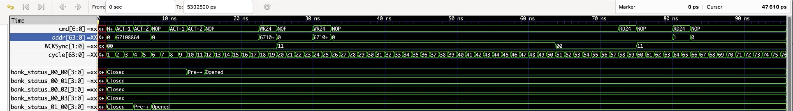

# Ramulator2 LPDDR6 Extension

Forked from:  
https://github.com/CMU-SAFARI/ramulator2

## Added
- Support for **standard LPDDR6**
- **VCD waveform** output

## Fixed (LPDDR5)
- Corrected configuration file bugs
- Fixed timing constraint errors

## LPDDR6 vs. LPDDR5

| Item                   | LPDDR5                        | LPDDR6                       |
|-----------------------|-------------------------------|-----------------------------|
| DQ per subchannel     | 8                             | 12                          |
| Burst length          | 16                            | 24                          |
| Data | All data                       | Data + metadata             |
| WCK : CK        | 2:1 / 4:1                     | 2:1                         |
| CA pins               | 7 shared by two subchannels   | 4 per subchannel               |
| WCK sync method       | CAS command required          | RD/WR can directly sync WCK |
| Command cycles        | 1                             | 2                           |
| tRCD                  | tRCD                          | tRCDr > tRCDw             |

## VCD Waveform Example

The simulator can generate a VCD file for visualizing DRAM command timing and signal activity.  
Below is an example waveform viewed in **GTKWave**:

## TODO
- Add support for **refresh** commands
- Add support for **auto-precharge** commands
